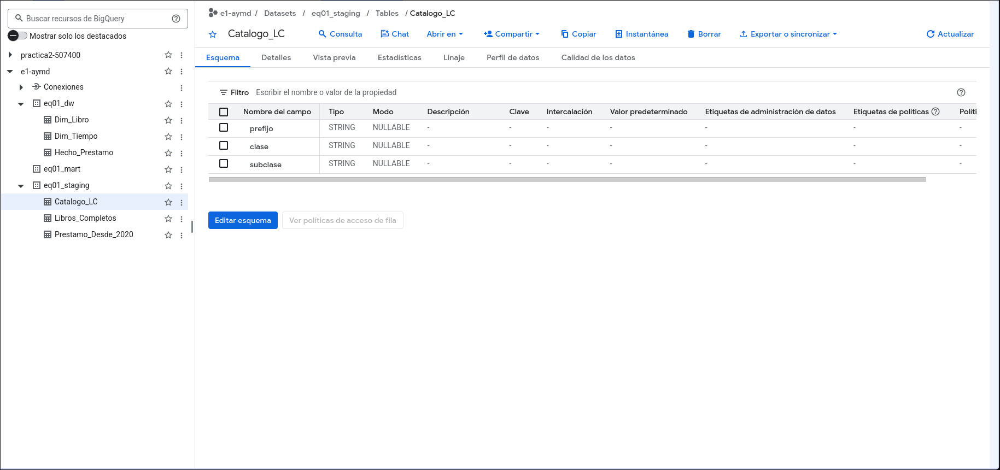
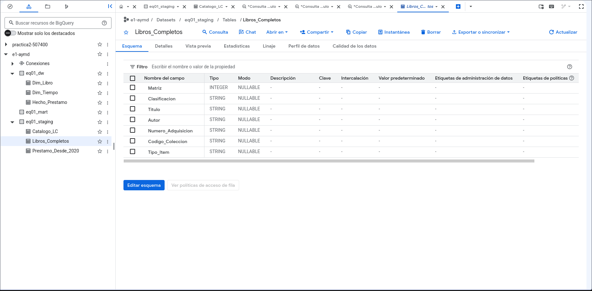
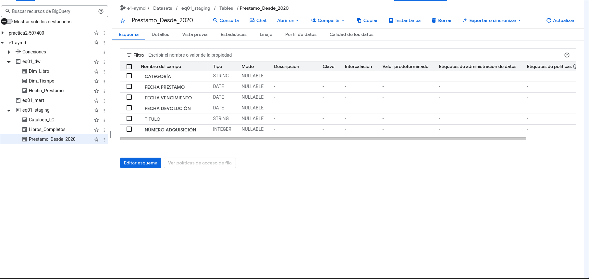
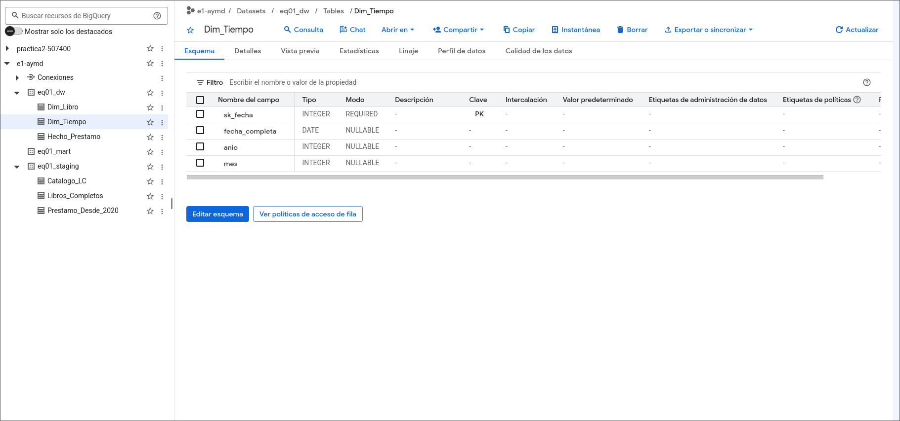
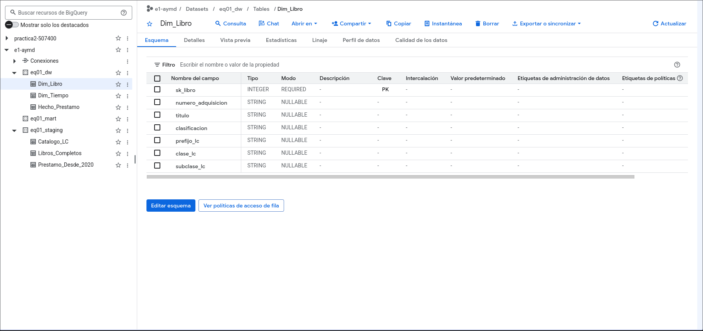
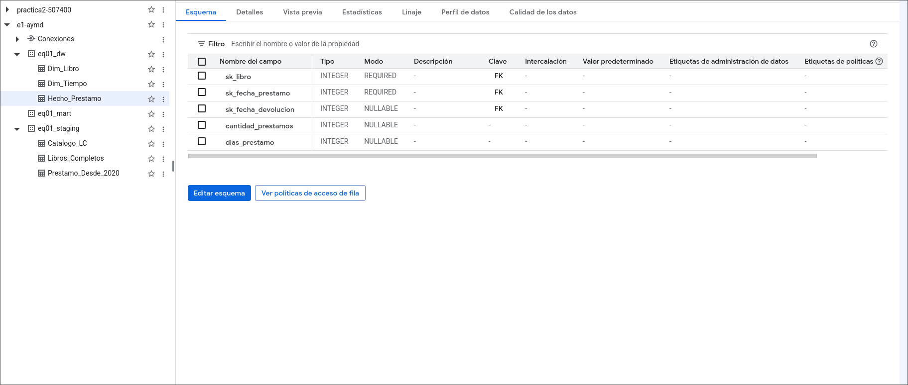
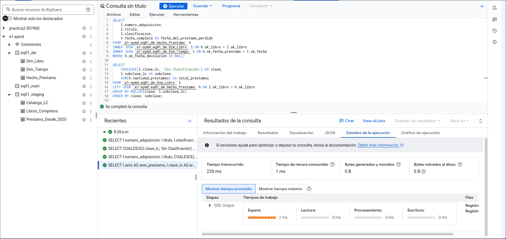

## Arquitectura de 3 Capas en Google Cloud

---

## 1. Zona de Staging

En esta capa (`eq01_staging`) están los datos extraídos de las fuentes originales. Aquí se aplicaron transformaciones de privacidad (eliminación de columnas PII como `_CREDENCIAL_` y `NOMBRE`) y se cargó el catálogo externo de la Library of Congress.

**Evidencia de esquemas de carga en Staging:**







---

## 2. Data Warehouse (Esquema Estrella)

`eq01_dw` se construyó utilizando el enfoque de Kimball (Esquema Estrella). 

El siguiente Script DDL fue ejecutado en BigQuery definiendo estrictamente las estructuras, metadatos y relaciones lógicas entre dimensiones y hechos.

### Script de Definición (DDL)

```sql

```

**Evidencia de la creación de los esquemas en el DW:**







---

## 3. Data Marts

En la capa final (`eq01_mart`) diseñamos las consultas SQL de análisis que responden directamente a las preguntas de negocio (P1-P4). 

Implementamos la función de jerarquía **`ROLLUP`** para los niveles de clasificación LC.

### Script de Consultas Analíticas

```sql

```

**Evidencia de validación sintáctica en BigQuery:**

