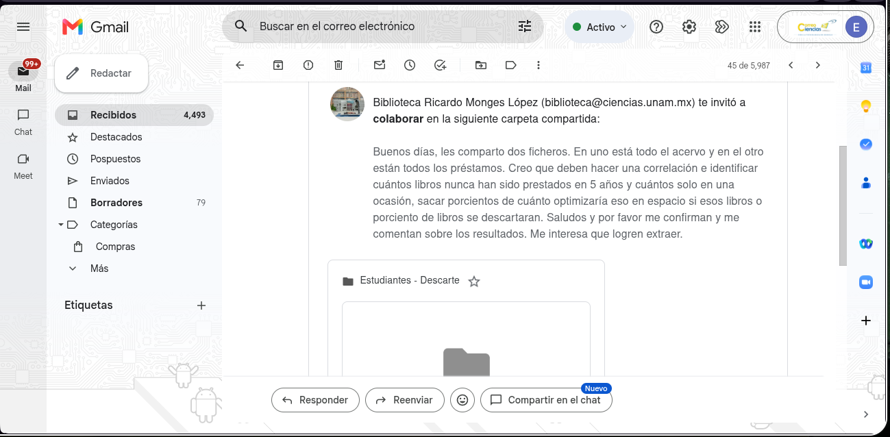
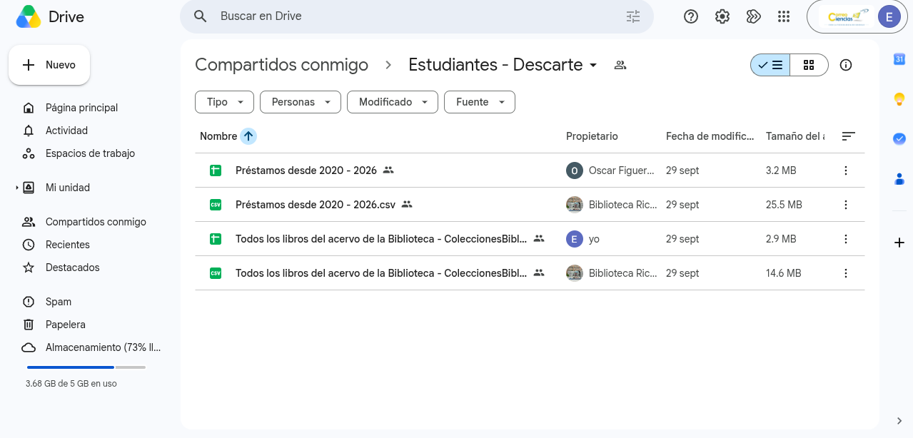
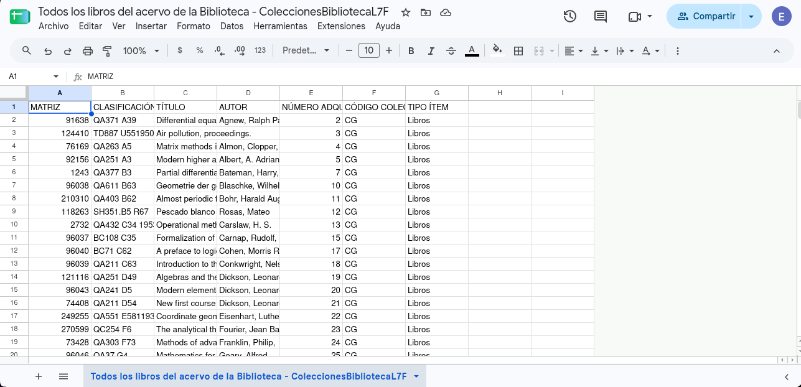
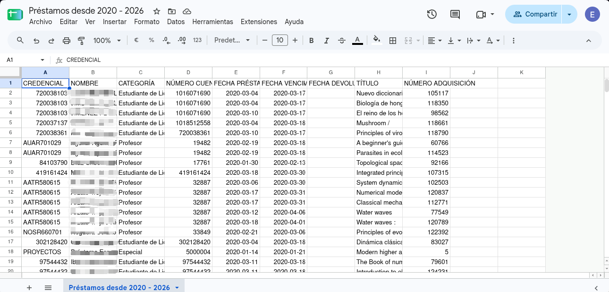
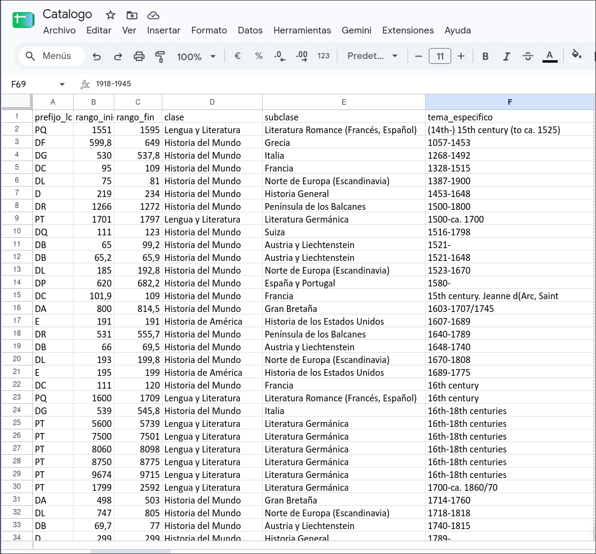

---
title: "Datos"
---

Los datos se obtuvieron directamente de la misma biblioteca de la Facultad de Ciencias.

## Obtención de datos

Al hablar por primera vez en la entrevista con la coordinadora de la biblioteca, se mostró abierta a prestarnos los datos del acervo y los préstamos de biblioteca para poder trabajar sobre estos mismos.

Es por esta razón que, en lugar de buscar en DeepSearch, portales de datos, buscadores de datasets o datos públicos, se visitó nuevamente el "búnker" de la biblioteca para solicitar una segunda reunion con la coordinadora.
Esta segunda reunión se llevo nuevamente a cabo en la oficina de la Dra. María Victoria Guzmán Sánchez, en esta ocasion no se tenia la intencionde "robarle" tanto tiempo a la coordinadora por lo que sin muchas vueltas se le solicitaron los datos acerca de los que nos había mencionado con anterioridad.

La coordinadora muy abierta y entusiasmada nos proporcionó a través de correo los datos del acervo de libros y de préstamos, los cuales son un par de datasets que contienen alrededor de 150 mil y 170 mil registros respectivamente, cada uno.

## Catálogo

::: {style="font-size: 1.5em; text-align: center;"}
{width="1000px"}
:::

::: {style="font-size: 1.5em; text-align: center;"}
{width="1000px"}
:::

### Libros del acervo

::: {style="font-size: 1.5em; text-align: center;"}
{width="1000px"}
:::

| Campo | Libros |
|-------|---------|
| Nombre y dueño | Todos los libros del acervo de la biblioteca, Facultad de Ciencias, UNAM |
| URL y acceso | Enlace verificado y forma de acceso (descarga, API, BigQuery) |
| Formato y tamaño | CSV de 14.6 MB |
| Grano | Cada fila representa un libro único perteneciente al acervo de la biblioteca |
| Cobertura | Todos los libros registrados en el acervo |
| Licencia y restricciones | No se presentó alguna restricción especial |
| Llaves de integración | Nombres e identificadores de libros; su catálogo se relaciona con los préstamos |
| Pregunta(s) relacionada(s) | Este catálogo alimenta directamente las cuatro preguntas planteadas en la E0, ya que contiene las características de qué libros están en el dataset y permite identificar cuáles no es posible localizar, sus características comunes y sus factores de relevancia |

### Préstamos de la biblioteca

::: {style="font-size: 1.5em; text-align: center;"}
{width="1000px"}
:::

| Campo | Prestamos |
|-------|---------|
| Nombre y dueño | Préstamos desde 2020, Facultad de Ciencias, UNAM |
| URL y acceso | Enlace verificado y forma de acceso (descarga, API, BigQuery) |
| Formato y tamaño | CSV de 25.5 MB |
| Grano | Cada fila representa un préstamo de un libro a una persona |
| Cobertura | Periodo 2020–2026 |
| Licencia y restricciones | Contiene nombres y números de cuenta de las personas que piden libros, los cuales se solicitó explícitamente que no fueran revelados |
| Llaves de integración | Nombres e identificadores de libros; su catálogo se relaciona con los préstamos |
| Pregunta(s) relacionada(s) | Este dataset también se relaciona con las cuatro preguntas, ya que brinda la información de los libros prestados, permitiendo relacionarlos con su información particular |

### Clasificación de la Library of Congress (Tercera fuente)

Durante la exploración de los datos del acervo, identificamos que los libros contaban con etiquetas complejas de catalogación (como QA611 o RC300). Tras investigar su significado, descubrimos que corresponden al sistema de clasificación de la **Library of Congress (LC)**. 

Para sacarle provecho, descargamos el *Outline* jerárquico completo de la LC y construimos un catálogo de 3 niveles (Clase, Subclase y Tema Específico), el cual cruzará mediante rangos numéricos y servirá como nuestra tercera fuente de datos externa.

::: {style="font-size: 1.5em; text-align: center;"}
{width="1000px"}
:::

| Campo | Catálogo LC |
|-------|---------|
| Nombre y dueño | Library of Congress Classification Outline |
| URL y acceso | Verificado en https://www.loc.gov/catdir/cpso/lcco/ (Convertido a CSV) |
| Formato y tamaño | CSV de menos de 1 KB |
| Grano | Cada fila representa un rango numérico asociado a un tema específico (ej. Geometría, Topología) dentro de una subclase LC |
| Cobertura | Clasificaciones internacionales de conocimiento |
| Licencia y restricciones | Es de dominio público, sin restricciones |
| Llaves de integración | El prefijo de letras y la evaluación de que el número del libro caiga dentro del rango numérico del tema |
| Pregunta(s) relacionada(s) | Alimenta directamente la P1 y P2 al permitirnos saber de qué "área de la ciencia" son los libros que nunca se prestan. |

## Análisis de integración

El acervo y los préstamos se unen a través del campo *NÚMERO ADQUISICIÓN*, el cual funciona como llave principal. Al hacer una revisión rápida en Python, vimos que el 100% de las llaves en los préstamos coinciden con el acervo. Además, la tercera fuente (el catálogo LC) se unirá usando la extracción de las letras del prefijo y evaluando matemáticamente el número de la *CLASIFICACIÓN* contra los rangos del catálogo.

La diferencia en su granularidad se encuentra principalmente en que, en los datos de préstamo —al ser únicos por fecha, alumno y libro—, hay repeticiones en la aparición de los libros, mientras que en los datos del acervo cada libro aparece una sola vez como un ejemplar físico. El catálogo LC es aún más general, pues agrupa muchas clasificaciones en una sola materia.

Algunos problemas que anticipamos tras revisar los datos son:

- **Tipos de datos distintos:** El sistema exportó el número de adquisición como texto (`STRING`) en el acervo, pero como número (`INTEGER`) en los préstamos. Tendremos que igualarlos a texto en BigQuery para que crucen.
- **Valores vacíos (nulos):** Notamos que alrededor del 1.1% de los préstamos no tienen fecha de devolución, lo que nos dará problemas al calcular tiempos de préstamo. También, 5,036 libros (3.3%) no tienen clasificación, por lo que no cruzarán con nuestra tercera fuente.
- **Baja calidad en metadatos (Autores):** Descubrimos que a casi la mitad del acervo (72,710 libros) le falta el registro del autor original. Por esta razón, tomamos la decisión arquitectónica de descartar esta variable y no incluirla en nuestra `Dim_Libro` para evitar un sesgo masivo en el análisis.
- **Libros sin uso:** Descubrimos que el 76% de los ejemplares del acervo no tienen ni un solo préstamo registrado entre 2020 y 2026.
